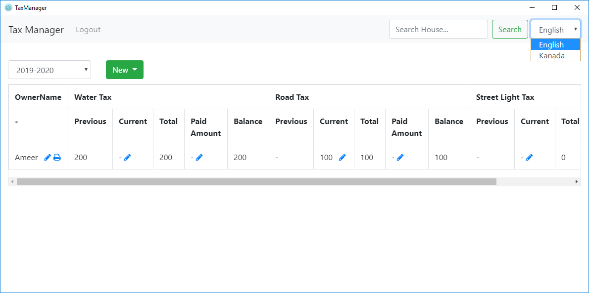
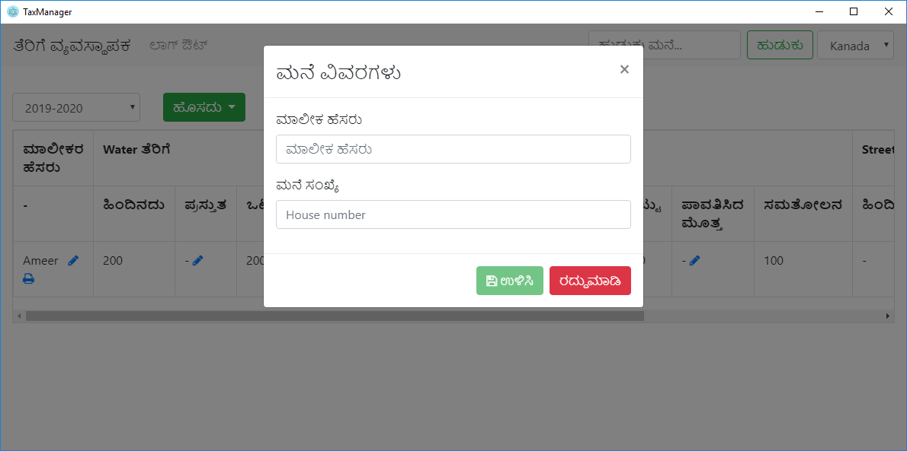

# Tax Manager

Tax management app for a village office to keep track of various taxes paid by people in that village

## Easy to use UI



## Multi lingual support



## Building from the source

1.  Clone the repo

```sh
git clone https://github.com/ameerthehacker/tax-manager.git
```

2.  Install the dependencies

```sh
npm install
```

3.  Create **.env** file

    In the directory electron copy **.env.example** file to **.env** and update the configurations

4.  Build the UI

```sh
npm run build
```

5.  Build the app

    Go to the electron directory and run

```sh
npm run package:win
```

The windows executable can be found in the directory **electron/dist**

6.  Copy the **.env** file to root of the executable directory

7.  Run the app and enjoy!

## How to develop locally :question:

This project consists of two projects

* Angular
* Express

1.  Start the angular dev server by running

```sh
ng serve
```

2.  Go to the electron directory and run

```sh
npm run express:start
```

## How to contribute :question:

Feel free to make an issue and discuss your idea before getting started

## License

MIT © [Ameer Jhan](mailto:ameerjhanprof@gmail.com)
